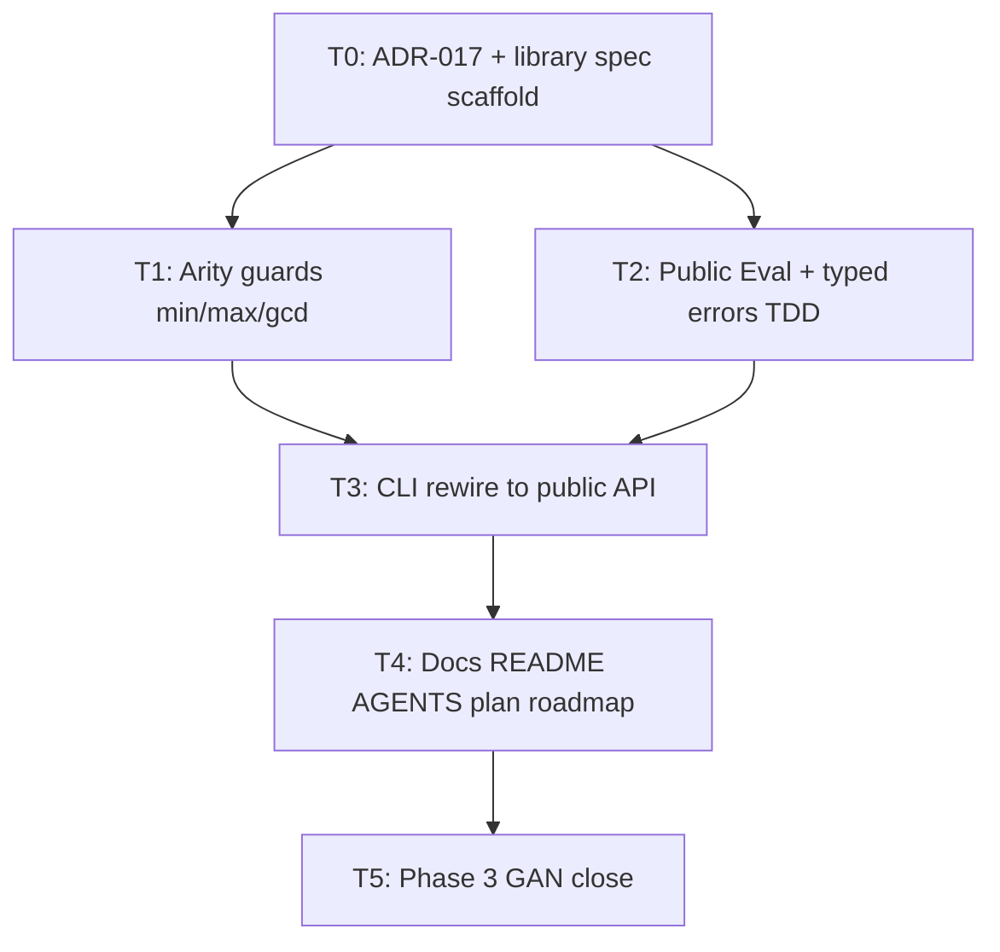

# Issue #20 — Task breakdown (public library API)

**Locked decisions** (Gate A answers):

| Q | Decision |
| - | -------- |
| 1 | Module-root `package goexeclatex` (not `pkg/`) |
| 2 | Omit float `EvalWithPrecision`; full-precision `Eval`; CLI keeps `-p` formatting; public `Format` MAY |
| 3 | Typed/stage errors + CLI exit 1 vs 2 wiring **in #20** |
| 4 | AST / Lex / Parse out of scope (ADR) |
| 5 | ≥2 arity guards for `min`/`max`/`gcd` |
| 6 | `vars == nil` OK; README basic math examples |
| 7 | One `docs/specs/library.md` + one ADR |

**Process per task:** AGENTS.md Phase 1 spec/ADR before code; Phase 2 TDD (red → green); conventional commits when asked. No feature branch until Gate B approval.

**Process twin:** `.agents/issues/issue-8/breakdown.md` (capability slices → here packaging slices).

## Overview

| Layer | Rationale |
| ----- | --------- |
| Spec / ADR | `library.md` + ADR-017 before shim code |
| Eval | Optional arity guards (`functions.go`) |
| Public library | Root `goexeclatex` package + tests |
| CLI / goldens | Rewire `main.go`; exit codes via typed errors; goldens green |
| Wiki / docs | README, AGENTS, plan, roadmap, index, log, GAN close |

## Dependency Graph

---

## Task 0 — ADR-017 + `docs/specs/library.md` scaffold

**Layer:** Spec / ADR  
**Depends on:** none  
**AC:** AC-MUST-1, AC-MUST-4, AC-MUSTNOT-1, AC-MUSTNOT-4

### What

Record the locked packaging decisions and write the normative public-API spec before any implementation. Ground in `docs/plan.md` and evaluatex (one-shot `Eval` vs compile/evaluate divergence). Update roadmap current focus to #20.

### Deliverable

- `docs/adrs/adr-017-public-library-api.md` (layout, typed errors, AST-out, omit float precision API)
- `docs/specs/library.md` (RFC 2119: `Eval`, nil vars, builtins/scope, error stages, Non-Scope)
- `docs/roadmap.md` current focus → #20; `docs/index.md` entries

### Acceptance Criteria

- [ ] ADR exists and matches Gate A Answers
- [ ] `library.md` has MUST/MUST NOT for API surface, errors, Non-Scope (AST, float precision helper)
- [ ] Roadmap lists #20 as current product focus (or co-focus)

### Verify

- **Command:** `test -f docs/adrs/adr-017-public-library-api.md && test -f docs/specs/library.md && rg -n 'MUST|Non-Scope|Eval|typed|AST' docs/specs/library.md docs/adrs/adr-017-public-library-api.md docs/roadmap.md`
- **Expect:** both files present; RFC 2119 + locked decisions greppable; roadmap mentions #20
- **Covers:** AC-MUST-1, AC-MUST-4

### Notes

Next ADR number after adr-016. Do not implement Go code in this task.

---

## Task 1 — Defensive arity for `min` / `max` / `gcd`

**Layer:** Eval  
**Depends on:** Task 0 (spec may note defense-in-depth; impl can cite ADR/issue comment)  
**AC:** AC-MUST-7

### What

Ensure `callBuiltin` returns an error (not panic) when `min`/`max`/`gcd` receive fewer than two evaluated args.

### Deliverable

- Spec note or eval spec cross-link if needed (optional one-liner in `library.md` / eval)
- Failing then passing table-driven test in `internal/eval`
- Guard in `internal/eval/functions.go` (or `callBuiltin`)

### Acceptance Criteria

- [ ] Under-arity → error, not panic
- [ ] Existing min/max/gcd happy paths unchanged

### Verify

- **Command:** `go test ./internal/eval/... -count=1 -run 'Min|Max|Gcd|Arity|callBuiltin'`
- **Expect:** red (test added) then green after guard; no panic on empty/`len==1` args
- **Covers:** AC-MUST-7
- **Tests:** table-driven

### Notes

String-only `Eval` already parser-enforced; this closes the #20 review comment. Broader arity table for all builtins is MAY / deferred.

---

## Task 2 — Public `Eval` + typed errors (TDD)

**Layer:** Public library  
**Depends on:** Task 0  
**AC:** AC-MUST-2, AC-MUST-6, AC-MUST-8, AC-MUSTNOT-3, AC-SHOULD-1 (nil vars)

### What

Add module-root `package goexeclatex` with `Eval(expr, vars)` delegating to `internal/{lexer,parser,eval}`, exporting stage-discriminable errors, accepting `nil` vars, seeding builtins like the CLI.

### Deliverable

- Root files e.g. `goexeclatex.go`, `errors.go` (names flexible)
- `goexeclatex_test.go` with `package goexeclatex_test` (external import style)
- Thin shim only — no duplicated pipeline logic

### Acceptance Criteria

- [ ] `Eval(\frac{1}{2}, nil)` → `0.5`
- [ ] Basic math + vars cases in tables
- [ ] Lex/parse failures vs eval failures distinguishable via `errors.As`
- [ ] No AST/Lex/Parse exports
- [ ] No float precision API

### Verify

- **Command:** `go test . -count=1` (module root) and `go doc github.com/stephen-mcelhose/goexeclatex`
- **Expect:** failing tests first (red), then PASS; `go doc` shows `Eval` + error types only (no Node/Lex/Parse)
- **Covers:** AC-MUST-2, AC-MUST-6, AC-MUSTNOT-1, AC-MUSTNOT-3, AC-MUSTNOT-4
- **Tests:** table-driven; external test package preferred

### Notes

May run in parallel with Task 1 after Task 0. Preserve internal error message text carefully so ADR-011 stripping still works after CLI rewire (or map typed errors to same user strings).

---

## Task 3 — CLI rewire to public API

**Layer:** CLI / goldens  
**Depends on:** Task 2 (and Task 1 if merged same branch)  
**AC:** AC-MUST-3, AC-MUSTNOT-2

### What

Change `cmd/goexeclatex` to call `goexeclatex.Eval` instead of importing `internal/{lexer,parser,eval}` directly. Map typed errors to exit 1 (lex/parse/input) vs 2 (eval). Keep `formatResult`, `parseVars`, ADR-011 `userMessage`/`die`.

### Deliverable

- Updated `cmd/goexeclatex/main.go`
- Unchanged golden expectations (or only intentional no-op diffs)

### Acceptance Criteria

- [ ] `main.go` does not import `internal/lexer`, `internal/parser`, or `internal/eval`
- [ ] Exit codes and stderr/stdout match existing tests
- [ ] `-p` still CLI-local formatting

### Verify

- **Command:** `go test ./cmd/goexeclatex/... -count=1` and `rg -n 'internal/(lexer|parser|eval)' cmd/goexeclatex/main.go` (expect no matches)
- **Expect:** all CLI tests PASS; rg finds no internal engine imports in `main.go`
- **Covers:** AC-MUST-3, AC-MUSTNOT-2

### Notes

Input/`-v` errors remain exit 1 before `Eval`. Inf still exit 0 (ADR-010).

---

## Task 4 — Docs: README, AGENTS, plan, roadmap, index, log

**Layer:** Wiki / docs  
**Depends on:** Task 3 (API shape stable)  
**AC:** AC-MUST-5

### What

Make docs honest: library + CLI split, import path, basic math examples, package layout in AGENTS/plan, roadmap tracker, wiki index/log.

### Deliverable

- `README.md` — import + `Eval` examples (frac, sqrt, vars)
- `AGENTS.md` — package layout includes public root package
- `docs/plan.md` — package tree + “CLI calls library”
- `docs/roadmap.md` — #20 status
- `docs/index.md`, `docs/log.md` as needed
- Cross-links from `library.md` / ADR-017

### Acceptance Criteria

- [ ] README is not aspirational-only
- [ ] AGENTS package layout lists public API + `cmd/` + `internal/`
- [ ] Plan tree matches shipped layout

### Verify

- **Command:** `rg -n 'goexeclatex.Eval|package goexeclatex|internal/lexer|library' README.md AGENTS.md docs/plan.md docs/roadmap.md docs/specs/library.md`
- **Expect:** import examples and layout mentions present; roadmap references #20
- **Covers:** AC-MUST-5

### Notes

Public `Format` helper remains MAY — do not document as shipped unless Task 2 included it.

---

## Task 5 — Phase 3 GAN closing review

**Layer:** Wiki / process  
**Depends on:** Task 4  
**AC:** AC-MUST-9

### What

Run the process Phase 3 discriminator pass (not plan.md Evaluator phase). Clear punch-list or defer with links. Comment on #20; update roadmap to closed/done when merged.

### Deliverable

- GAN checklist comment on #20
- Wiki lint notes / fixes on touched pages
- Final roadmap/log touch if needed

### Acceptance Criteria

- [ ] Spec vs plan/evaluatex: one-shot API divergence documented
- [ ] Spec vs tests: library MUST rules pinned
- [ ] False-success probes: external import, README honesty, exit 1 vs 2, ADR-011 text
- [ ] Docs drift cleared
- [ ] `go test ./...` green

### Verify

- **Command:** `go test ./... -count=1`
- **Expect:** PASS
- **Manual:** Gate C comment on #20 with discriminator table rows checked or deferred
- **Covers:** AC-MUST-9

### Notes

Compare close quality to issue-8 GAN comment style.

---

## Risks & Decisions

| Risk | Likelihood | Impact | Mitigation |
| ---- | ---------- | ------ | ---------- |
| Typed error `Error()` text breaks ADR-011 goldens | Medium | High | Preserve strip-compatible messages; test CLI goldens early in Task 3 |
| Root package name conflicts with `cmd/goexeclatex` | Low | Low | CLI is `package main` in subdirectory — fine |
| Scope creep into public `Format` | Low | Low | MAY only; omit unless explicitly pulled in |
| Broader arity panic surface ignored | Low | Medium | Document MAY deferral in ADR / GAN |

## Deferred Decisions

- Public `Format(v, prec) string` matching CLI §7 — MAY / follow-up
- Broader `callBuiltin` arity table for all builtins — MAY
- Separate Lex vs Parse error types — MAY share one “syntax” type if eval remains distinct (AC-MAY-3)
- Exposing AST / compile-then-eval — out of scope; revisit only with new issue + ADR superseding ADR-017

## Sources

- `.agents/issues/issue-20/clarification.md` (Answers + AC)
- `.agents/issues/issue-20/explore.md`
- `.agents/issues/issue-8/breakdown.md` (process twin)
- `AGENTS.md`, ac-plan-loop / breakdown-issue skills
