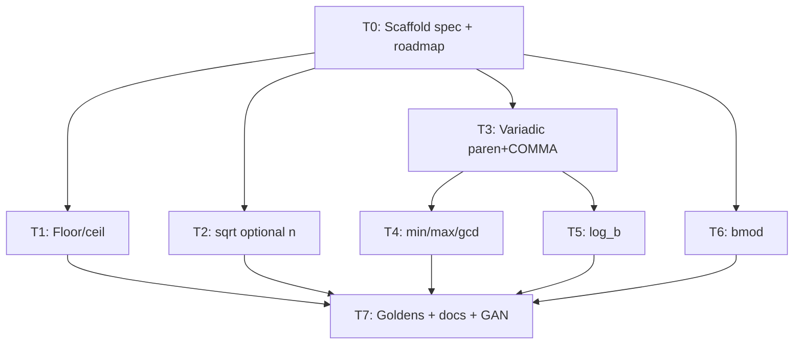

# Issue #8 — Task breakdown (v0.4)

**Locked decisions** (Gate A answers):

| Q | Decision |
| - | -------- |
| 1 | `\_` out of scope (ADR-013) |
| 2 | Milestone label **v0.4** |
| 3 | `\min`/`\max`/`\gcd`: **n ≥ 2** args |
| 4 | Ship **`\bmod` only** as binary remainder; defer `\pmod`/`\mod`/`\pod` |
| 5 | New `docs/specs/parser-extensions.md` + surgical lexer/parser/eval updates |
| 6 | Mixed floor/ceil round out of scope (ADR-014) |
| 7 | Unary paren form **SHOULD** keep working (`\sin(x)`) |

**Process per task:** extend/update normative spec → failing table-driven tests (red) → implement (green) → conventional commit.

## Overview

| Layer | Rationale |
| ----- | --------- |
| Spec / ADR | Phase 1 before each capability |
| Lexer | New tokens / patterns / arity |
| Parser | Grammar for paired, optional, variadic, log_b, bmod |
| Eval | Builtins + binary mod |
| CLI / docs | Goldens, roadmap, GAN close |

## Dependency Graph

---

## Task 0 — Scaffold `parser-extensions` spec + roadmap focus

**Deliverable:** `docs/specs/parser-extensions.md` with scope, locked decisions, deferred list (`\pmod`/`\mod`/`\pod`, ADR-014); roadmap current focus → v0.4 / #8; index entry.

**AC:** Spec exists with RFC 2119 keywords and Non-Scope section; roadmap points at #8.

### Verify
- **Command:** `test -f docs/specs/parser-extensions.md && rg -n 'MUST|Non-Scope|v0.4' docs/specs/parser-extensions.md docs/roadmap.md`
- **Expect:** file present; keywords and v0.4 focus found
- **Covers:** AC-MUST-1

---

## Task 1 — Floor / ceil (matched pairs only)

**Deliverable:** Spec § floor/ceil; lexer tokens (NORM-like); parser depth + `FunctionNode`/`floor`/`ceil`; eval `math.Floor`/`math.Ceil`; mixed pairs error (ADR-014).

**AC:** AC-MUST-2, AC-MUSTNOT-2, AC-SHOULD-1, ADR-014 mismatch rule.

### Verify
- **Command:** `go test ./internal/lexer/... ./internal/parser/... ./internal/eval/... -count=1 -run 'Floor|Ceil|Lfloor|Lceil'`
- **Expect:** red then green; `\lfloor 3.2 \rfloor`→3, `\lceil 3.2 \rceil`→4; mixed → parse error; no implicit-multiply AST
- **Covers:** AC-MUST-2, AC-MUSTNOT-2, AC-SHOULD-1
- **Tests:** table-driven lexer/parser/eval

---

## Task 2 — `\sqrt[n]{x}` optional index

**Deliverable:** Spec § nth-root; parser/lexer so `[n]` is optional index not false char-mode arg; eval `math.Pow(x, 1/n)` with domain rules; `\sqrt{x}` unchanged.

**AC:** AC-MUST-3, AC-MUSTNOT-2.

### Verify
- **Command:** `go test ./internal/parser/... ./internal/eval/... -count=1 -run 'Sqrt|NthRoot|Root'`
- **Expect:** `\sqrt[3]{27}`→3; `\sqrt{9}`→3; negative radicand / invalid n error per spec
- **Covers:** AC-MUST-3
- **Tests:** table-driven

---

## Task 3 — Variadic paren-arg grammar + COMMA

**Deliverable:** Spec § paren args; parser consumes `(` sum {`,` sum} `)` after designated commands; unary `(expr)` for arity-1 preserved (AC-SHOULD-3).

**AC:** substrate for AC-MUST-4/5; AC-SHOULD-3.

### Verify
- **Command:** `go test ./internal/parser/... -count=1 -run 'Paren|Comma|Variadic|SinParen'`
- **Expect:** COMMA inside supported paren lists parses; `\sin(x)` still OK; bare `1,2` still errors
- **Covers:** AC-SHOULD-3 (partial MUST-4)
- **Tests:** table-driven parser

---

## Task 4 — `\min` / `\max` / `\gcd` (n ≥ 2)

**Deliverable:** Spec + arity wiring + eval builtins; n ≥ 2 enforced.

**AC:** AC-MUST-4.

### Verify
- **Command:** `go test ./internal/parser/... ./internal/eval/... -count=1 -run 'Min|Max|Gcd'`
- **Expect:** `\min(3,1,2)`→1; `\max(3,1)`→3; `\gcd(12,8)`→4; arity &lt; 2 errors
- **Covers:** AC-MUST-4
- **Tests:** table-driven

---

## Task 5 — `\log_{b}(x)`

**Deliverable:** Spec; special-case `log` like sum/prod: optional subscript base + paren (or brace) arg; plain `\log{x}` remains log10.

**AC:** AC-MUST-5.

### Verify
- **Command:** `go test ./internal/parser/... ./internal/eval/... -count=1 -run 'Log'`
- **Expect:** `\log_{2}(8)`→3; `\log{100}`→2; domain errors for ≤0
- **Covers:** AC-MUST-5
- **Tests:** table-driven

---

## Task 6 — `\bmod` binary remainder

**Deliverable:** Spec; `\bmod` as binary op (product-level or remap); eval remainder policy documented; `\pmod`/`\mod`/`\pod` explicitly deferred in Non-Scope.

**AC:** AC-MUST-6 (scoped to `\bmod`).

### Verify
- **Command:** `go test ./internal/parser/... ./internal/eval/... -count=1 -run 'Bmod|Mod'`
- **Expect:** `10 \bmod 3`→1; not implicit multiply; deferred forms still not “mod eval”
- **Covers:** AC-MUST-6
- **Tests:** table-driven

---

## Task 7 — CLI goldens, docs refresh, GAN close

**Deliverable:** `stdin.txt` cases; examples/how-to/roadmap/gap-analysis; GAN checklist comment on #8; punch-list fixed or deferred with links.

**AC:** AC-MUST-8, AC-SHOULD-4.

### Verify
- **Command:** `go test ./cmd/goexeclatex/... -count=1` and manual GAN checklist on issue
- **Expect:** goldens pass; issue GAN comment completed
- **Covers:** AC-MUST-7 (process), AC-MUST-8, AC-SHOULD-4
