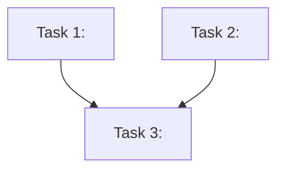

# Breakdown Issue

Takes a clarified issue (or any well-scoped description) and produces an
ordered task list where every task has:

- A clear deliverable
- Explicit inputs and expected outputs
- Acceptance criteria you can verify before moving to the next task
- A `### Verify` subsection (command + expected result)

For goexeclatex milestone work, tasks MUST align with `AGENTS.md`: spec-first
then TDD (red → green), and Phase 3 closing review when the milestone completes.

## Workflow

### 0. Establish Artifact Directory

```
ARTIFACT_DIR = <workspace>/.agents/issues/issue-<IDENTIFIER>/
```

Announce: "Artifacts will be written to: `<ARTIFACT_DIR>`"

### 1. Load Context

Prefer `<ARTIFACT_DIR>/clarification.md` from a prior `clarify-issue` run.
If the user pastes context, it MUST include:

- `## Codebase Touchpoints`
- `## Assumptions Being Made`
- `## Open Items`

Otherwise say: run `/clarify-issue` first, or reformat with those headings.

Prioritise `## Answers` over the original question text. If
`## Acceptance Criteria (RFC2119)` exists, map tasks to AC ids.

### 2. Identify the Layers

Three passes over the clarification doc (not the raw issue):

**Pass 1 — Codebase Touchpoints** → map each file/package to a layer below.
**Pass 2 — Assumptions** → add implied layers even if no file was listed.
**Pass 3 — Open Items** → include those layers but mark tasks
`⚠️ Blocked by: [open item]`.

Write an `## Overview` in `breakdown.md` listing active layers before any tasks.

| Layer | Examples (goexeclatex) |
| ----- | ---------------------- |
| Spec / docs | `docs/specs/*.md`, ADRs, roadmap, OKF frontmatter |
| Lexer | `internal/lexer/` token types, scanning |
| Parser | `internal/parser/` AST, grammar |
| Eval | `internal/eval/` builtins, numeric semantics |
| CLI / goldens | `cmd/goexeclatex/`, stdin/error golden fixtures |
| Wiki / process | `docs/` lint, `AGENTS.md`, session log |

For layer-specific AC formats, see `references/layers.md`.

### 3. Write the Dependency Graph

Before tasks, produce a Mermaid graph under `## Dependency Graph`.



Rules: every task is a node; edges dependency → dependent; label with number +
short title.

### 4. Write the Breakdown

Tasks must be sequenced, atomic, and testable.

#### Task Format

```markdown
## Task <N>: <Short imperative title>

**Layer**: <layer>
**Depends on**: Task <N-1> (…) — or "none"
**AC**: AC-MUST-1, … (if RFC2119 section exists)

### What
<One paragraph. What and why. No how.>

### Deliverable
<Concrete artifact: spec section, token, parse rule, test file, golden, …>

### Acceptance Criteria
- [ ] <Verifiable condition>
- [ ] <Layer-appropriate verification — see references/layers.md>

### Verify
- **Command:** `go test ./internal/parser/... -run TestFoo -count=1`
- **Expect:** PASS (or red stubs until implement)
- **Covers:** AC-MUST-1
- **Tests:** Prefer table-driven when multi-case

### Notes
<Gotchas, files to read first, deferred decisions.>
```

Every task **MUST** include `### Verify`. Prefer the format in
`../ac-plan-loop/references/task-verify.md` when that file is present.

### 5. Ordering Rules (priority order)

1. **Spec before code** — normative `docs/specs/` (and ADRs when needed) before
   implementation tasks
2. **Lexer before parser before eval** when the change spans the pipeline
3. **Package tests before CLI goldens**
4. **No orphan tasks** — if N produces what N+1 consumes, say so

### 6. Flag Risks

```markdown
## Risks & Decisions

| Risk | Likelihood | Impact | Mitigation |
| ---- | ---------- | ------ | ---------- |
| ...  | ...        | ...    | ...        |

## Deferred Decisions
Things left for later, with rationale.
```

### 7. Write the Artifact

If `<ARTIFACT_DIR>/breakdown.md` exists, ask overwrite vs cancel before writing.

Prepend OKF frontmatter:

```yaml
---
type: task-breakdown
title: <issue title or kebab-case identifier>
description: <one sentence>
resource: <GitHub issue URL if known>
tags: [<active layers as kebab tags>]
timestamp: <UTC ISO-8601>
---
```

Write to `<ARTIFACT_DIR>/breakdown.md`.

### 8. Present and Confirm

- List tasks as a numbered summary in chat.
- Ask: looks good / adjust / split or reorder.
- If looks good: say continue with `/ac-plan-loop` Gate B approval, or
  implement Task 1 per `AGENTS.md` (spec → TDD). Do **not** start coding
  until the user confirms the breakdown (or Gate B).

## Quality Bar

A good breakdown lets someone who never saw the issue produce something
testable from a single task.

## Safety

- Do not modify source code.
- Do not create branches or commits.
